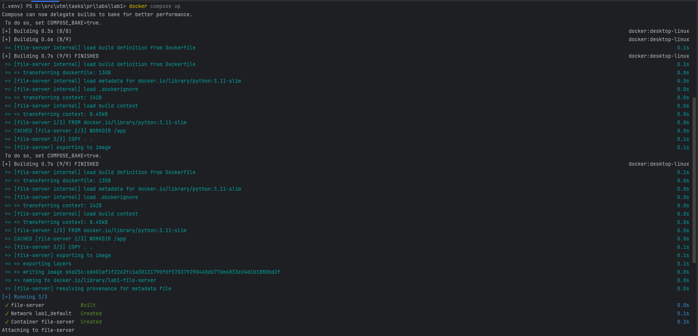
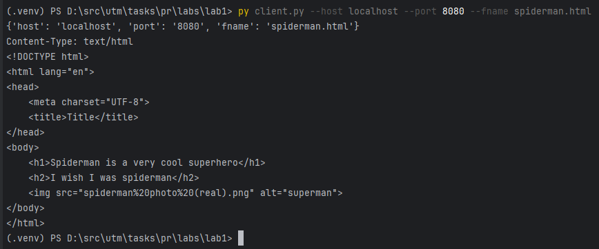

## Laboratory work 1: HTTP file server

### Task:

Build a simple HTTP server using TCP sockets that serves files from a given directory (passed as a command-line argument). The server should:

* Handle one request at a time.

* Parse HTTP requests and locate the requested file in the directory.

* Send a proper HTTP response with headers + file content.

* Support HTML, PNG, and PDF files.

* Return 404 Not Found if the file is missing or unsupported.

### Work done

- Created `HttpServer` class
- Created `HttpHelper` module with util functions
- Wrote `Dockerfile` for `server.py`
- Wrote `docker-compose.yml` file which builds the root repository image (defined in `Dockerfile`)

---

### Technical implementations:

If there are additional configurations of the scripts, which require parsing command-line arguments, it's done in the format: `--arg value` 

#### Server:

_Available configurations:_ `host`, `port`, `dir` (served directory). Default: `0.0.0.0`, `8080`, `.`

- Used method `setsockopt(socket.SOL_SOCKET, socket.SO_REUSEADDR, 1)` to reuse the socket immediately even if it's in `WAITING` state
- To ensure all chunks are sent, used `sendall` method
- File handling and security: used `urllib` to handle escape characters in urls (eg `%20`); used validation of url introduced to make sure filepath is within served directory

#### Client:

_Available configurations:_ `host`, `port`, `fname`, `dpath` (download path), `https` (0 or 1 to make the client run via `https`). Default: `localhost`, `8080`, ` `, `down/`, `0`

- Added possibility to provide the methods of request (`GET`, `POST` and others)
- HTML files are printed by default, and image and pdf files are saved in directory passed in system args
- Made sure client has read the whole message using `Content-length` header.

### Screenshots

Running `docker compose up`:



Opening `localhost:8080`:


Opening `japanese_book.pdf` (firefox default viewer)


Opening `spiderman photo` which shows that spaces are escaped


Opening `spiderman.html` which references spiderman photo


Opening `jungle_book.pdf` which shows the ability to work with subdirectories


Using `client` for opening `spiderman.html`



Downloading `fiction/pulp.png` into `down/` directory


The file is actually downloaded:


Some file is not found on the server:


### How to run the laboratory

Execute this in powershell:

```bash
git clone https://github.com/TimurCravtov/NetworkProgrammingLabs.git
cd NetworkProgrammingLabs/lab1
docker compose build --no-cache
docker compose up
```

Then, in `localhost:8080` the file server will serve the `served/` directory. To override the default settings, change the command and/or port in [docker-compose.yml](docker-compose.yml).

