## Laboratory work 1: HTTP file server

### Task:

Build a simple HTTP server using TCP sockets that serves files from a given directory (passed as a command-line argument). The server should:

* Handle one request at a time.

* Parse HTTP requests and locate the requested file in the directory.

* Send a proper HTTP response with headers + file content.

* Support HTML, PNG, and PDF files.

* Return 404 Not Found if the file is missing or unsupported.

### Work done

- Created `HttpServer` class
- Created `HttpHelper` module with util functions
- Wrote `Dockerfile` for `server.py`
- Wrote `docker-compose.yml` file which builds the root repository image (defined in `Dockerfile`)

---

### Technical implementations:

If there are additional configurations of the scripts, which require parsing command-line arguments, it's done in the format: `--arg value` 

#### Server:

_Available configurations:_ `host`, `port`, `dir` (served directory). Default: `0.0.0.0`, `8080`, `.`

- Used method `setsockopt(socket.SOL_SOCKET, socket.SO_REUSEADDR, 1)` to reuse the socket immediately even if it's in `WAITING` state
- To ensure all chunks are sent, used `sendall` method
- File handling and security: used `urllib` to handle escape characters in urls (eg `%20`); used validation of url introduced to make sure filepath is within served directory

#### Client:

_Available configurations:_ `host`, `port`, `fname`, `dpath` (download path), `https` (0 or 1 to make the client run via `https`). Default: `localhost`, `8080`, ` `, `down/`, `0`

- Added possibility to provide the methods of request (`GET`, `POST` and others)
- HTML files are printed by default, and image and pdf files are saved in directory passed via `--dpath`
- Made sure client has read the whole message using `Content-length` header.
- Can make request through the internet by setting `--https 1`

### Screenshots

[Dockerfile](Dockerfile) - based on python images, copies all the files from the root to `/app`, and runs `python server.py`. _Info_: not all the files are necessary, but they are removed using `.dockerignore`

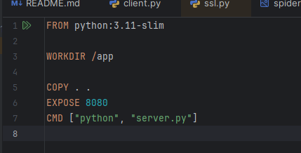

[Docker Compose file](docker-compose.yml) - defines a single service called `file-service` which builds the current `Dockerfile`, adds a bind volume root (`./`) in `/app`, overrides the `command` and connects `8080` port of the image to `8080` on the host.

As one can see, the command which runs the server is

```bash
python server.py --host 0.0.0.0 --port 8080 --dir served/ 
```

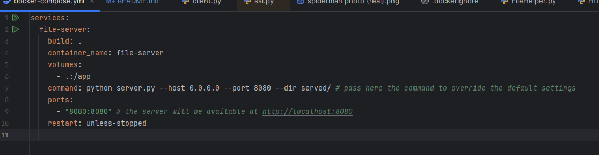

Running `docker compose up`, which builds the image and starts serving.

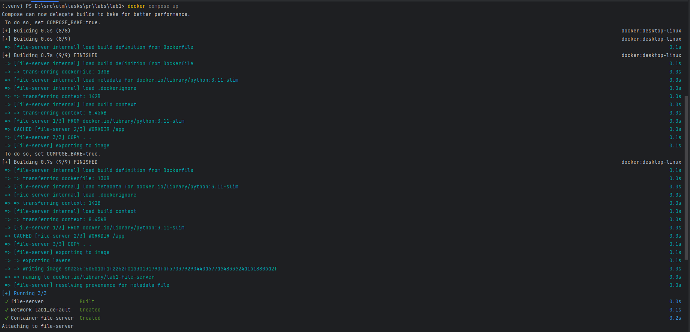

Opening `localhost:8080`, which is directory listing for `/served`

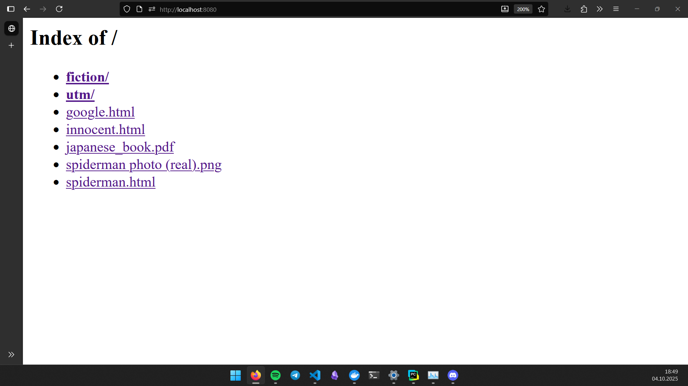

Opening `japanese_book.pdf` (firefox default viewer)


Opening `spiderman photo` which shows that spaces are escaped


Opening `spiderman.html` which references spiderman photo


Opening `jungle_book.pdf` which shows the ability to work with subdirectories


Opening a `file.md` file and getting error 404 even though the file DOES exist, but extension is not supported


Opening a `file.png` file and getting error 404 while file doesn't exist


Using `client` for opening `spiderman.html`:

The client can be used with following command:

```bash
python client.py --host localhost --port 8080 -fname spiderman.html --dpath down/ 
```

And if the parameters are not provided in the flag, the defaults are used:

```python
host, port, filename, download_path, https = (
        args.get("host", "localhost"),
        int(args.get("port", 8080)),
        quote(args.get("fname", "/")),
        args.get("dpath", "."),
        bool(int(args.get("https", 0)))
    )
```
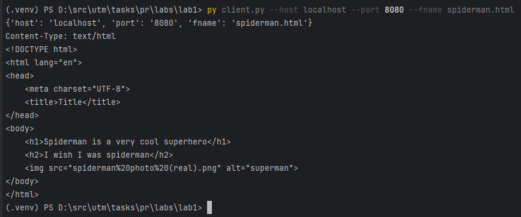

Downloading `fiction/pulp.png` into `down/` directory

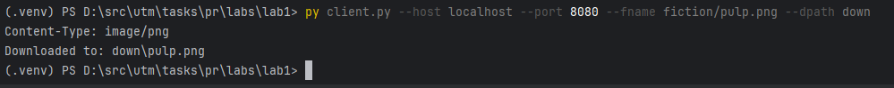

The file is actually downloaded:

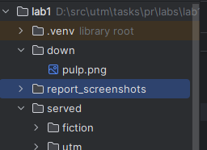

Some file is not found on the server:

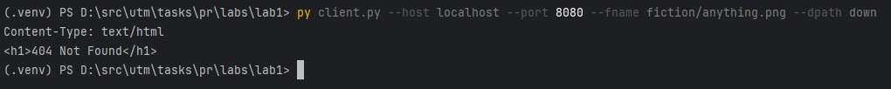

#### Browsing friends' files:

To browse my colleague's files, he connected to my hotspot. Then, he executed the command `ipconfig` command in powershell and gave me his ip address: ` 10.229.224.169`


Then, I opened in my browser the given Ip addess:

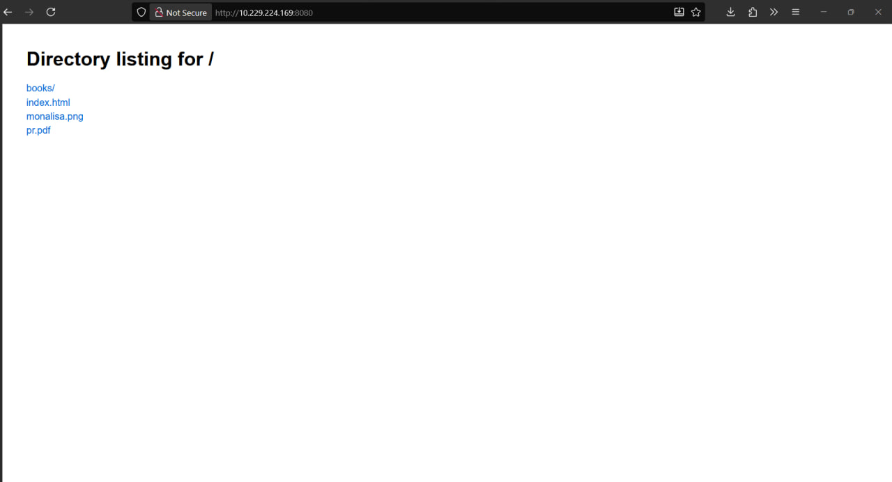

And downloaded a file from their server using the command: 

```bash
py client.py --host 10.229.224.169 --port 8080 --fname /books/ml-book.pdf --dpath served/down
```


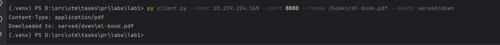

The file is actually downloaded:

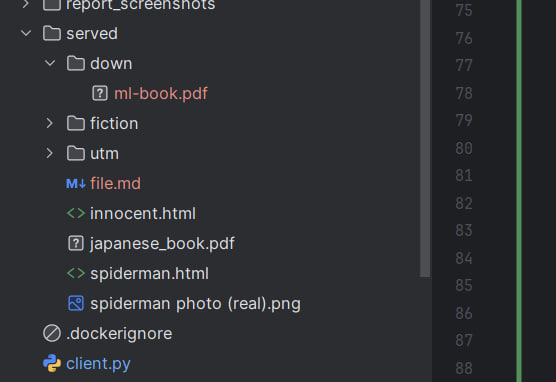

Since `./` is bind mounted, without recreating the image, I got the new file listed in my file server:


### How to run the laboratory

Execute this in powershell:

```bash
git clone https://github.com/TimurCravtov/NetworkProgrammingLabs.git
cd NetworkProgrammingLabs/lab1
docker compose build --no-cache
docker compose up
```

Then, in `localhost:8080` the file server will serve the `served/` directory. To override the default settings, change the command in [docker-compose.yml](docker-compose.yml).

