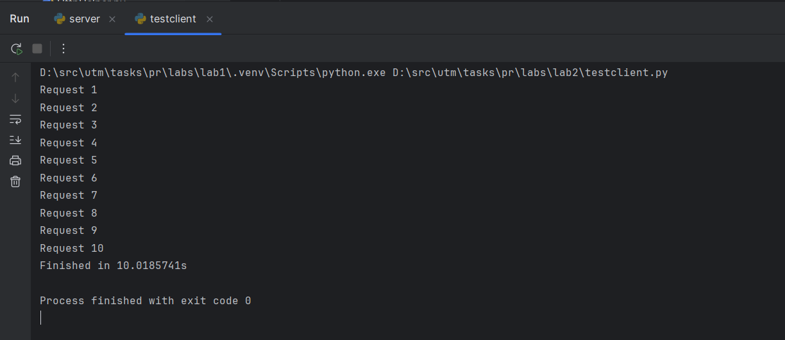
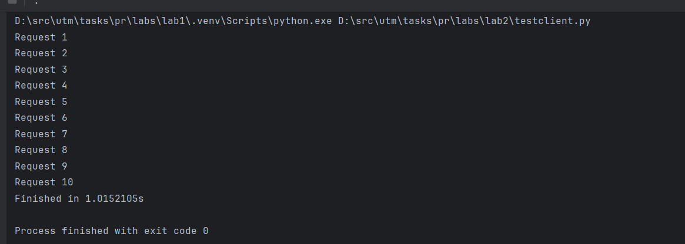
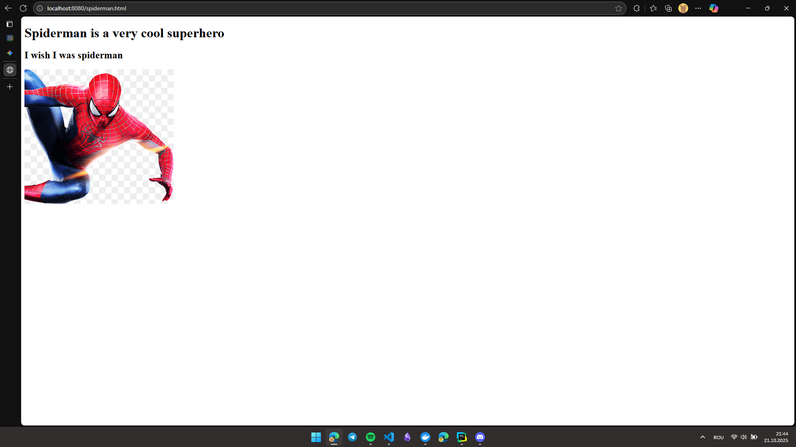
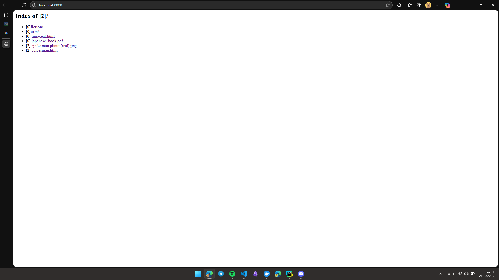
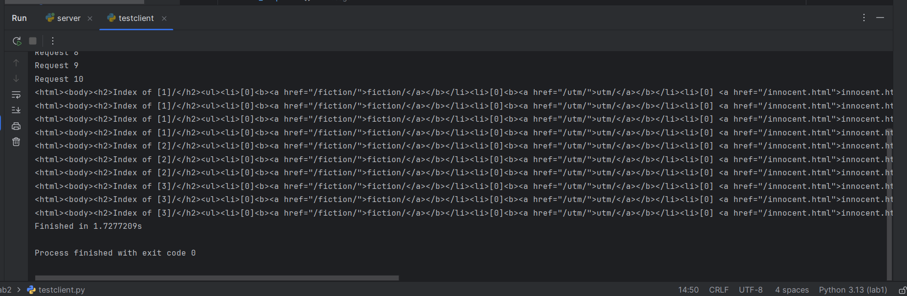
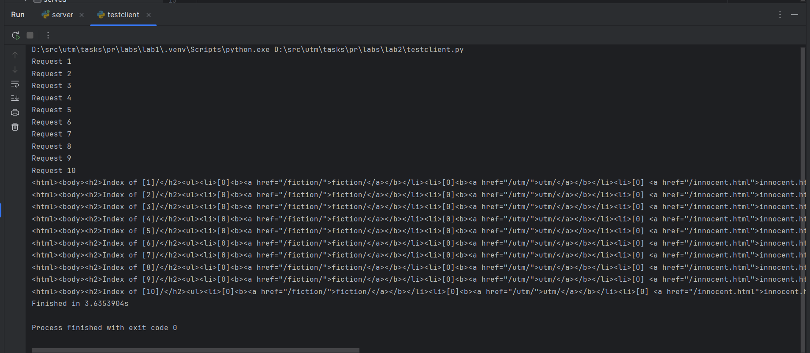
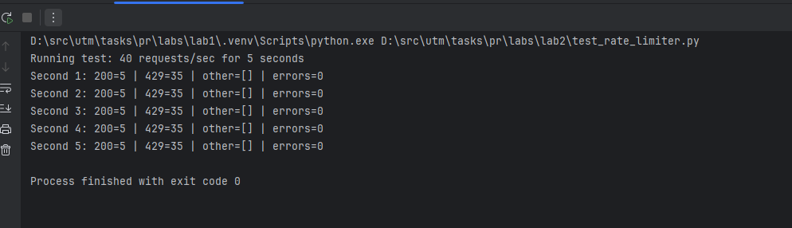
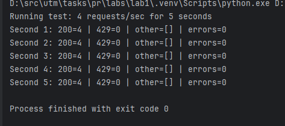

## Laboratory work 2: Concurrent HTTP file server

### Task:

- Make the HTTP server concurrent so it can handle multiple clients simultaneously.
- Implement a Hit Counter to track how many times files and directories are requested.
- Implement a Rate Limiter (IP-based) to prevent abuse by limiting requests per second.

### Work done

- Implemented `HtmlServer` with a thread pool using `concurrent.futures.ThreadPoolExecutor` to handle connections concurrently.
- Implemented `HitCounter` with optional locking to demonstrate race conditions and correctness under concurrency.
- Implemented `IpRequestFilter` as a simple per-second rate limiter which returns HTTP 429 when the limit is exceeded.
- Updated `client.py` to work with the server for testing and demonstration.
- Added small test script `test_rate_limiter.py` to exercise the rate limiter under load.

---

### Technical implementations

#### Server (concurrency and HTTP basics)

The server uses Thead Pool for concurrency. Max workers count is 1000. Each request is then executed in handle_request method

```python
    def serve_forever(self):
        self.bind_socket()
        self.sock.listen(100)
        print(f"Server running on http://{self.host}:{self.port}")

        with ThreadPoolExecutor(max_workers=1000) as executor:
            while True:
                conn, addr = self.sock.accept()
                print("Connected by", addr)
                executor.submit(self.handle_request, conn, addr)
```

Edge cases considered:
- Path traversal is prevented by checking `os.path.commonpath([served_directory, filepath]) == served_directory`.
- Directory listing counts use `HitCounter` to show hits next to entries.
- Client disconnects and malformed requests are handled by closing the connectio

#### Hit Counter

- `HitCounter` keeps a map from filename (or directory path) to an integer hit count. It provides `hit(filename)` to register a hit and `hit_count(filename)` to retrieve the count.
- The constructor option `with_lock` simulates correct behavior (True) or a race condition (False). When `with_lock=True` the counter increments are guarded by a threading.Lock; when `with_lock=False` increments are done without synchronization and a small sleep (`sleeping` argument) is used to amplify race conditions for demonstration.

```python
import threading
import time
from collections import defaultdict

class HitCounter:
    def __init__(self, with_lock=False, sleeping: float = 0):
        # ...

    def hit(self, filename: str):
        if self.with_lock:
            with self.lock:
                self.increment_hit(filename)
        else:
            self.increment_hit(filename)

    def increment_hit(self, filename: str):
        current = self.hit_count(filename)
        time.sleep(self.sleeping)
        self.file_counter_map[filename] = current + 1

    def hit_count(self, filename: str):
        return self.file_counter_map[filename]

```

The method `hit` is called when one requests directory listing or file hit. And hit_count is called for directory listing to print the number of hits of the directory itself and its dirs and files.

#### Rate limiter (IPRequestFilter)

- `IpRequestFilter` implements a simple token-bucket-like limiter on a per-second basis: it stores counts in `current_second_map` keyed by client IP and allows up to `requests_per_second` per IP per wall-clock second.
- The filter is thread-safe and uses a lock (`request_update_lock`) when updating counts and rolling over to a new second.
- When the limit is exceeded, the server responds with HTTP 429 Too Many Requests and closes the connection.


```python

class IpRequestFilter:
    def __init__(self, requests_per_second: int):
        # ...
    def process(self, address: str) -> bool:

        now = int(time.time())

        with self.request_update_lock:

            if now > self.current_second:
                self.current_second = now
                self.current_second_map = {}

            count = self.current_second_map.get(address, 0) + 1
            self.current_second_map[address] = count

            return count <= self.requests_per_second
```

Usage of Rate Limiter:
```python
        # in handle request method
        if not self.filter.process(addr[0]):
            conn.sendall(self.page_too_many_requests)
            conn.shutdown(socket.SHUT_WR)
            time.sleep(0.01)

            conn.close()
            return
```

#### Client and tests

- `client.py` remains a small HTTP client that can print HTML or save images/PDFs when Content-Type indicates non-text content.
- `test_rate_limiter.py` uses `requests` plus ThreadPoolExecutor to generate N requests per second and reports how many responses were 200 vs 429. This script was used to produce the rate limiter screenshots.

---

### Screenshots

Running a single-threaded server (artificial delay introduced):



Running a multi-threaded server (same delay) shows concurrent handling:



Directory listing and hit counter in action:


Opening a file served by the server:



Refreshing the page multiple times to increase hits:



Hit counter demonstration without lock (race conditions visible when many concurrent updates):

```python
self.hit_counter = HitCounter(with_lock=False, sleeping=0.3)
```



With locking enabled the hit counts update reliably:

```python
self.hit_counter = HitCounter(with_lock=True, sleeping=0.3)
```



Rate limiter test run (example with 40 requests/sec):



Rate limiter test run (example with 4 requests/sec):



---

### How to run the laboratory

Execute this in powershell:

```powershell
git clone https://github.com/TimurCravtov/NetworkProgrammingLabs.git
cd NetworkProgrammingLabs/lab2
docker compose build --no-cache
docker compose up
```

Then, open `http://localhost:8080` in your browser to browse the `served/` directory. The server can be configured with command-line flags in `server.py` (see `FileHelper.parse_args`): `--host`, `--port`, `--dir`.

To run the rate limiter test locally (without Docker) you can run:

```powershell
py -3 -m pip install requests
py test_rate_limiter.py
```

Notes:
- To demo the hit counter race condition, change the `HitCounter` initialization in `HttpServer.py` to `with_lock=False` and set `sleeping` to a small value (e.g., `0.3`) and then refresh pages concurrently.
- The rate limiter is intentionally simple (per-second counts) for demonstration; a production limiter would use sliding windows or leaky-bucket/token-bucket algorithms.
