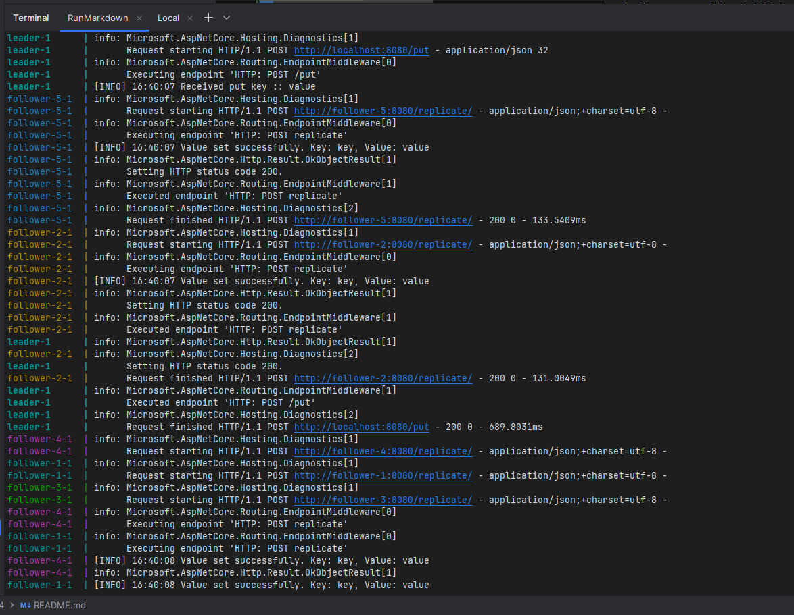
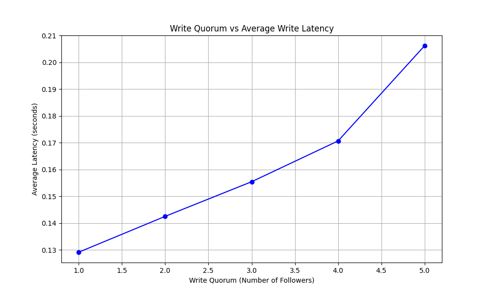
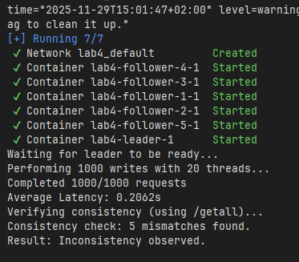

## Laboratory Work #4: Leader-Follower key-value storage system


### Introduction

Keeping the data on one machine can have multiple limitations. Now, data is usually kept on multiple machines for couple of resons:

- To keep data closer to users (and reduce latency)
- To continue working even if some parts have failed
- To scale the number of machines that can serve read queries

In that system, `Replica` is an instance of node which stores the copy. Common solution of replication is called `Leader-Follower` replication. In this system, there exists a designated leader which acceps the write and sends a replication requests to followers, and followers. Usually, Both leaders and followers accepts reads.

There are different types of this approach: syncronous or asyncronous. This laboratory work uses semi-synchronous approach which guarantees that you have an up-to-date copy of the data on at least two nodes.

### Manual test:

First, one can define the WRITE_QUORUM using environment variables

```bash
$env:WRITE_QUORUM = "2"
echo $env:WRITE_QUORUM
```

Next, run the container

```bash
docker compose down
docker compose up
```

Make a post request with a specified payload

```bash
curl -Method POST "http://localhost:8080/put" -Headers @{ "Content-Type"="application/json" } -Body '{"key": "key", "value": "value"}'
```

Read either the leader of follower

```bash
curl.exe http://localhost:8080/get?key=key
```

As you can notice in the logs below, when two followers reply, the leader accepts the write into his own storage.



Now, using `client/client.py` the integration test was performed. 

Graph below represents the dependence of the latency with respect to write quorum given. This graph corresponds the expectations.



The sql formula of this is the following:

```sql
SELECT MAX(latency_ms) AS replication_latency
FROM (
    SELECT latency_ms
    FROM followers
    ORDER BY latency_ms
    LIMIT :write_quorum
) AS q;
```

A importent inperfection of current implementation is incosistency in the results. 



This happens due to no syncronisation mechanism of applying the patches to storage with given number of keys. For example, we want to add an entry `{"k": "1"}`, and then immediatly `{"k": "2"}`. Due to network lag, the second request is handled faster than the first one, and applied first, while the first one is applied after. There are multiple possibility of dealing with this challenge:

1) Include Timestamp in the request log. In this case, the newest entries will only replace oldest if they came after
2) Use sequencital number. Same logic as timestamp with number ordering instead of time ordering
3) Use key versioning. Have a structure like `key -> value, version` in both leader in followers. The patch can only be applied if the version is higher.
4) Keep the full log of the updates. Not good in practice, since requires big ammount of memory.

### Conslusions

During this laboratory work, I implemented a leader-follower key-value storage. I got a graph which shows the dependence of latency based on write quorum and it showed a lineal dependency. In my implementation, the incosistency in data was observed due to no mechanism which tracks the order of applying the data. 

